# Trading212 Home Assistant Integration

[](https://github.com/Smart-Home-Assistant-UK/homeassistant-trading212/releases)
[](https://github.com/hacs/integration)
[](LICENSE)
[](https://www.home-assistant.io/)
[](https://smarthomeassistant.co.uk/tools/trading212-home-assistant)

A read-only [Home Assistant](https://www.home-assistant.io/) custom component (HACS integration) for [Trading212](https://www.trading212.com/) that exposes your investment portfolio as sensor entities. Track your stocks, ETFs, and ISA — account summary, individual positions, pies, daily movers, and dividends — directly in Home Assistant dashboards and automations.

> **Full documentation, screenshots, and setup walkthrough:** [smarthomeassistant.co.uk/tools/trading212-home-assistant](https://smarthomeassistant.co.uk/tools/trading212-home-assistant)

> **Don't have a Trading212 account yet?** Sign up with [this referral link](https://www.trading212.com/invite/1BlRG9Ii19) and we both receive a free share worth up to £100.

| Default theme | iOS dark theme |
|---------------|----------------|
| 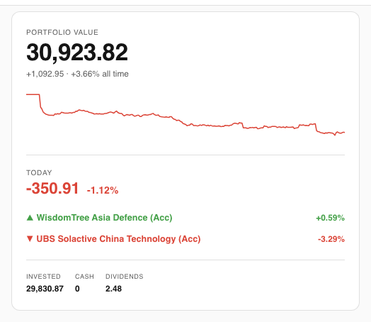 |  |

---

## Requirements

- Home Assistant 2024.1 or later
- A Trading212 account (Invest, ISA, or Demo)
- A Trading212 API key — generate one at **Settings → API** in the Trading212 app

---

## Installation

### Via HACS (recommended)

1. Open HACS → **Integrations → Explore & Download Repositories**
2. Search for **Trading212** and install
3. Restart Home Assistant

### Manual

Copy the `custom_components/trading212` folder into your HA `config/custom_components/` directory and restart.

---

## Setup

1. **Settings → Devices & Services → Add Integration**
2. Search for **Trading212**
3. Enter your API key, choose environment (Live or Demo), and set a poll interval

If you have both Live and Demo accounts, add the integration twice — once per environment.

---

## Sensors

### Account

| Sensor | Description |
|--------|-------------|
| `sensor.trading212_total_value` | Total portfolio value |
| `sensor.trading212_invested` | Total cost basis |
| `sensor.trading212_unrealized_pnl` | Open profit / loss |
| `sensor.trading212_realized_pnl` | All-time realised gains |
| `sensor.trading212_result_percent` | Overall return % |
| `sensor.trading212_cash_available` | Uninvested cash |
| `sensor.trading212_cash_in_pies` | Cash held inside pies |
| `sensor.trading212_total_dividends` | Total dividends received |
| `sensor.trading212_open_positions_count` | Number of open positions |
| `sensor.trading212_active_orders_count` | Pending orders |
| `sensor.trading212_daily_gain_loss` | Today's P&L |
| `sensor.trading212_daily_gain_loss_percent` | Today's return % |
| `sensor.trading212_top_daily_mover` | Best performer today |
| `sensor.trading212_bottom_daily_mover` | Worst performer today |
| `sensor.trading212_biggest_daily_gain` | Largest gain today |
| `sensor.trading212_biggest_daily_loss` | Largest loss today |
| `sensor.trading212_last_updated` | Last successful poll |

### Per position

Six sensors per holding, where the slug is the ticker lowercased with non-alphanumeric characters replaced by `_` (e.g. `VWRL` → `vwrl_eq`):

| Sensor | Description |
|--------|-------------|
| `sensor.trading212_<slug>_value` | Current market value |
| `sensor.trading212_<slug>_pnl` | Unrealised P&L |
| `sensor.trading212_<slug>_pnl_percent` | Return % |
| `sensor.trading212_<slug>_quantity` | Shares held |
| `sensor.trading212_<slug>_avg_price` | Average purchase price |
| `sensor.trading212_<slug>_current_price` | Current market price |

### Per pie

> **What are Pies?** Pies are Trading212's built-in portfolio buckets that let you group stocks and ETFs with target allocations and auto-invest rules. Each pie appears as its own set of sensors here.

Ten sensors per pie, where the slug is the pie name lowercased with spaces and symbols replaced by `_` (e.g. `Aggressive but Safe` → `aggressive_but_safe`):

| Sensor | Description |
|--------|-------------|
| `sensor.trading212_<slug>_value` | Pie market value |
| `sensor.trading212_<slug>_invested` | Amount invested |
| `sensor.trading212_<slug>_pnl` | Unrealised P&L |
| `sensor.trading212_<slug>_pnl_percent` | Return % |
| `sensor.trading212_<slug>_cash` | Uninvested cash in pie |
| `sensor.trading212_<slug>_progress` | Progress toward goal % |
| `sensor.trading212_<slug>_goal` | Target goal amount |
| `sensor.trading212_<slug>_dividends_gained` | Total dividends earned |
| `sensor.trading212_<slug>_dividends_in_cash` | Dividends held as cash |
| `sensor.trading212_<slug>_dividends_reinvested` | Dividends reinvested |

The **value** sensor for each pie also exposes a `tickers` state attribute — a list of the instrument tickers held within that pie (e.g. `["VWRL_EQ", "SMGBL_EQ"]`). This is used by the companion lovelace card to filter the asset allocation treemap to a single pie.

---

## Dashboard Examples

Ready-to-use dashboard configs are in [`docs/dashboards/`](docs/dashboards/).

### Trading212 Card (recommended)

The companion [lovelace-trading212-card](https://github.com/Smart-Home-Assistant-UK/lovelace-trading212-card) gives you purpose-built cards that auto-detect your sensors with zero config.

**Install via HACS (custom repository — category: Plugin):**
1. HACS → Frontend → ⋮ → **Custom repositories**
2. URL: `https://github.com/Smart-Home-Assistant-UK/lovelace-trading212-card` · Category: **Plugin**
3. Add → install → reload browser

```yaml
type: custom:investment-health-card
```

```yaml
type: custom:investment-portfolio-card
```

Full dashboard YAML: [`docs/dashboards/investment-card.yaml`](docs/dashboards/investment-card.yaml)

| Health | Portfolio |
|--------|-----------|
|  | 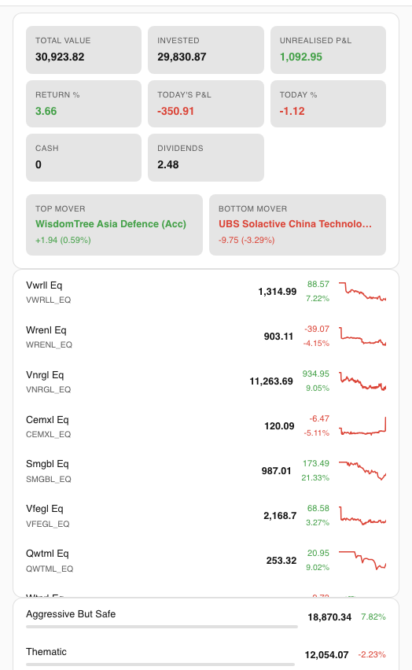 |

| Positions | Positions expanded |
|-----------|--------------------|
| 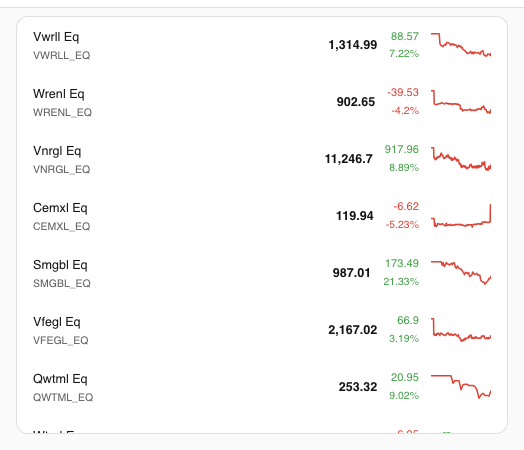 |  |

| Pies | Pies expanded |
|------|---------------|
| 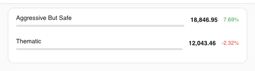 |  |

#### Asset allocation

Three modes side by side — all positions, positions filtered to one pie, and pies overview:

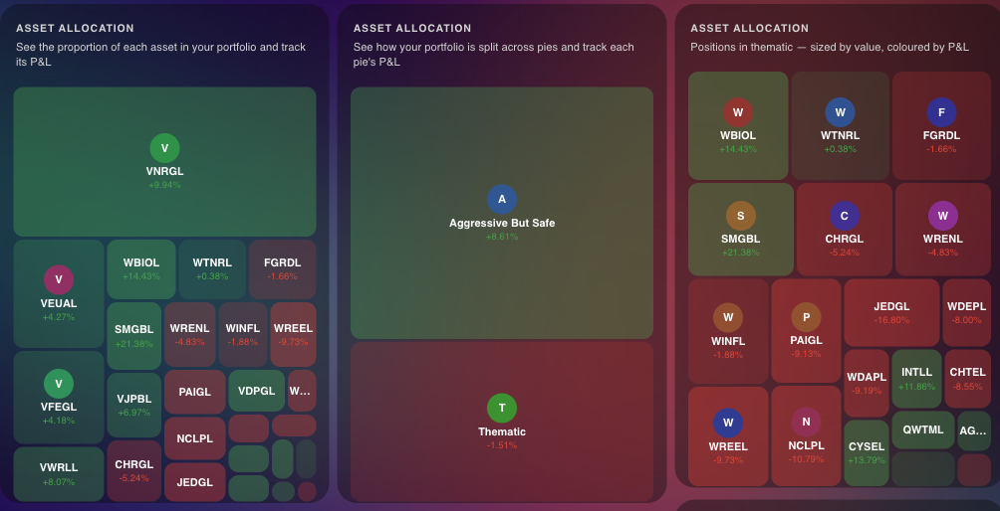

#### iOS dark theme

| Health | Portfolio |
|--------|-----------|
|  | 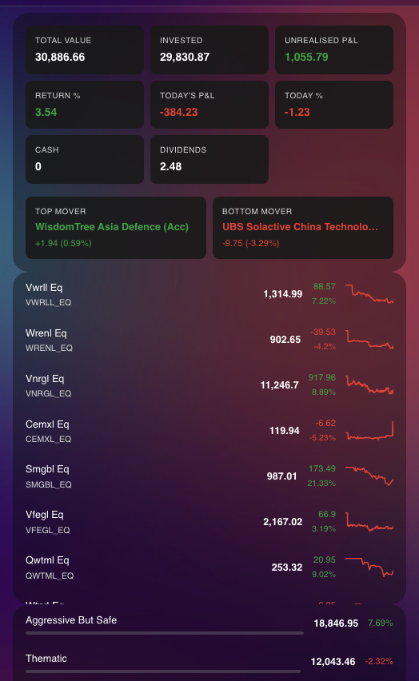 |

| Positions | Pies |
|-----------|------|
| 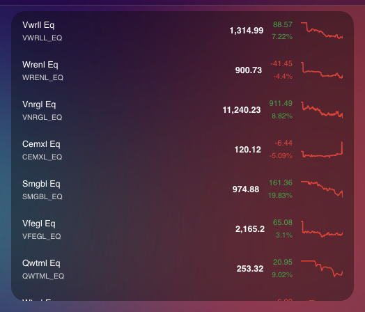 | 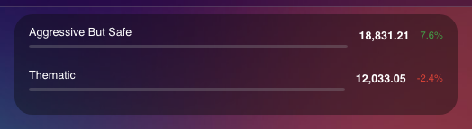 |

### Basic (no dependencies)

Works out of the box with a standard Home Assistant install — no extra card types needed.

Full dashboard YAML: [`docs/dashboards/basic.yaml`](docs/dashboards/basic.yaml)

| Overview | Positions | Pies |
|----------|-----------|------|
| 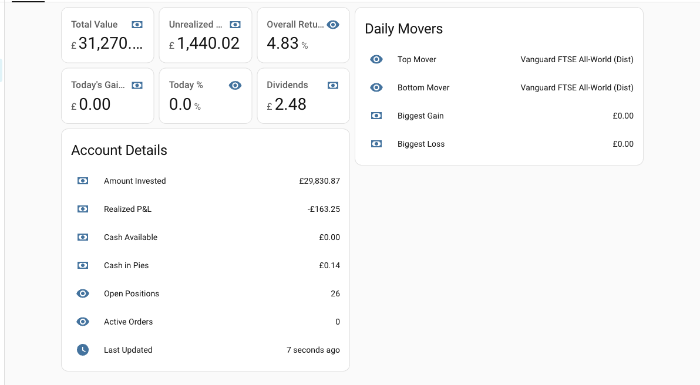 | 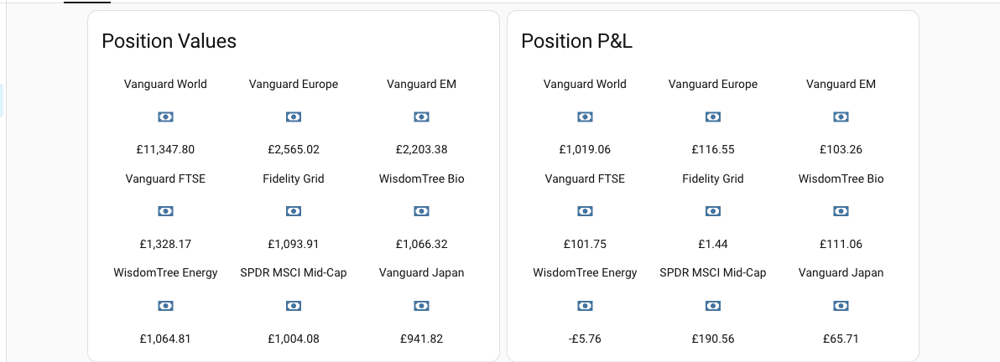 | 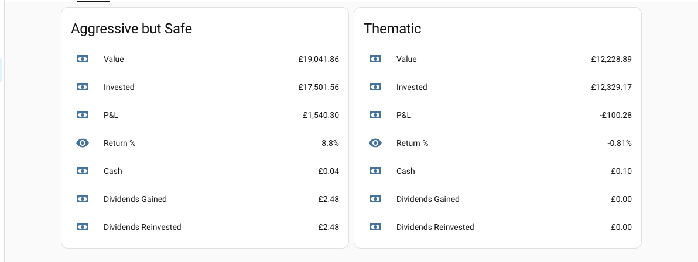 |

### Mushroom

Requires [Mushroom Cards](https://github.com/piitaya/lovelace-mushroom) (available on HACS).

Full dashboard YAML: [`docs/dashboards/mushroom.yaml`](docs/dashboards/mushroom.yaml)

| Overview | Positions | Pies |
|----------|-----------|------|
| 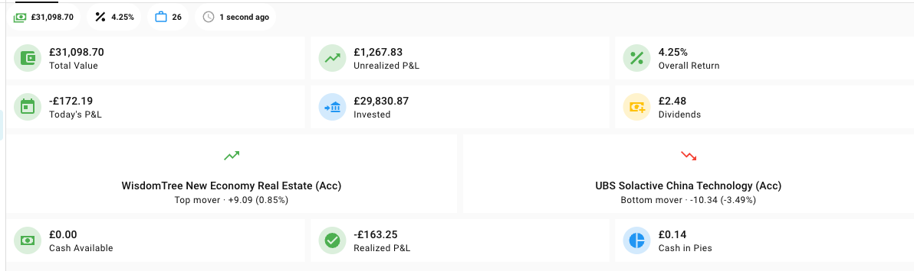 | 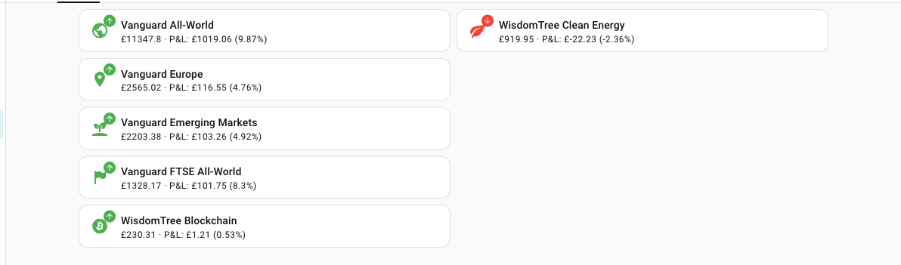 | 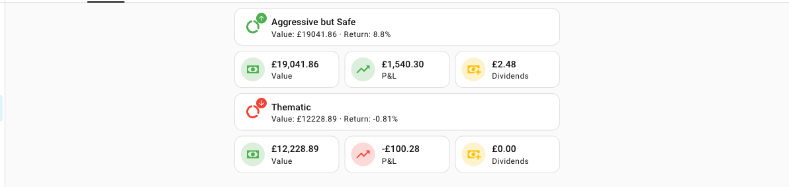 |

---

## Notes

- **Read-only** — this integration cannot place or cancel orders
- **Poll interval** — minimum 30 s, default 60 s; be mindful of Trading212's rate limits
- **Daily P&L** — calculated by comparing current values to a snapshot taken at the start of each calendar day; resets at midnight local time

---

## Troubleshooting

**Sensors show `unavailable`**
Check that your API key is valid and has not been revoked. Go to Trading212 → Settings → API and regenerate if needed, then update the integration via Settings → Devices & Services.

**Rate limit errors in the logs**
Increase the poll interval in the integration options. Trading212 enforces per-minute and per-day limits; 60 s is a safe default.

**Daily P&L resets at the wrong time**
Daily gain/loss is calculated against a midnight snapshot using your Home Assistant server's local time. If your HA instance runs in UTC, the reset will happen at midnight UTC rather than your local midnight.

**Pie sensors are missing**
Pie sensors are created from the pie name at setup time. If you rename a pie in Trading212, remove and re-add the integration to regenerate sensor IDs with the new name.

---

## Contributing

Contributions are welcome. Here's how to get started:

### Dev setup

```bash
pip install -r requirements_test.txt
```

### Running tests

```bash
pytest
```

### Guidelines

- Keep the integration **read-only** — no order placement or account mutations
- New sensors should follow the existing naming convention (`sensor.trading212_<slug>_<metric>`)
- Add or update tests for any changed behaviour; the test suite uses `pytest-homeassistant-custom-component` with async mocks via `aioresponses`
- Open an issue before starting large changes so we can align on approach

### What's in scope

- Additional Trading212 API endpoints (dividends history, orders, etc.)
- Bug fixes and accuracy improvements
- Dashboard examples under `docs/dashboards/`
- HACS compatibility improvements

---

## License

[MIT](LICENSE) © Sepehr Sabbagh-pour
